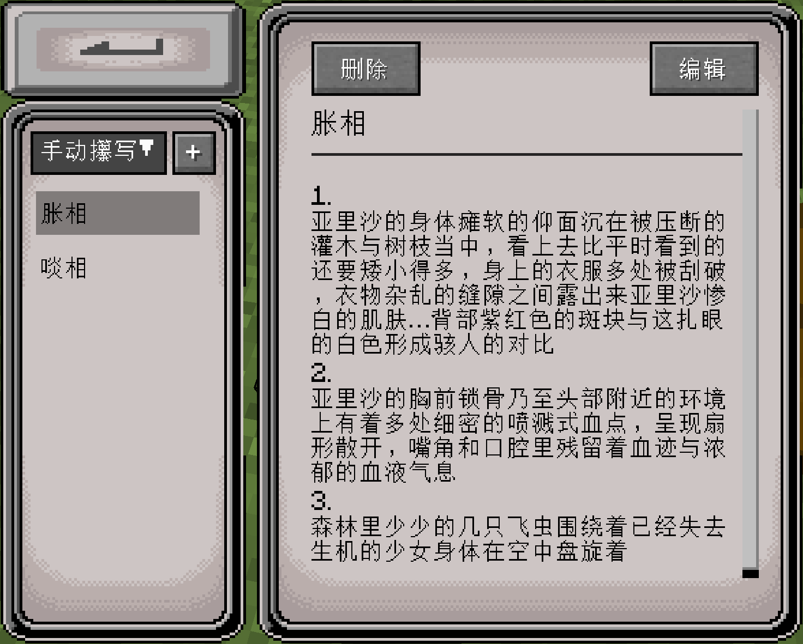
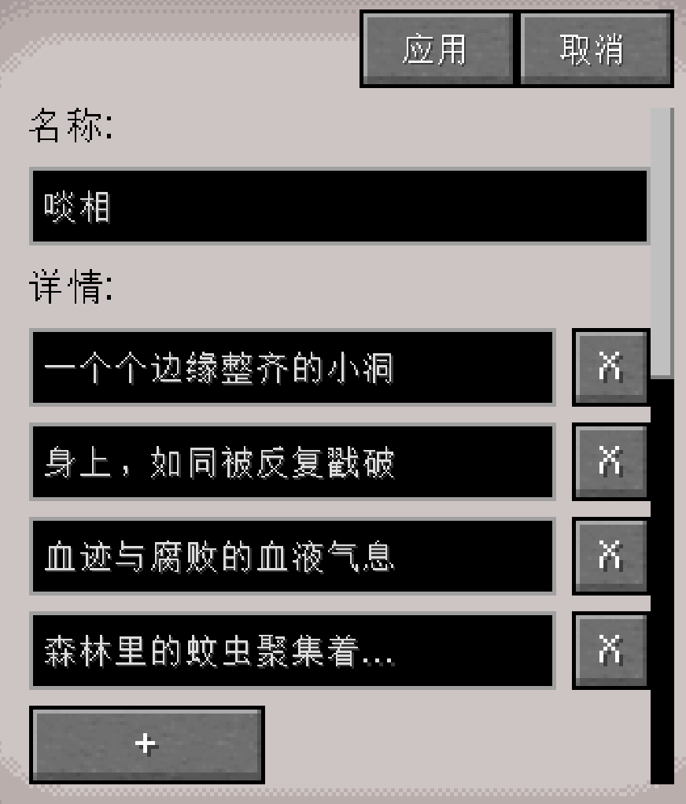
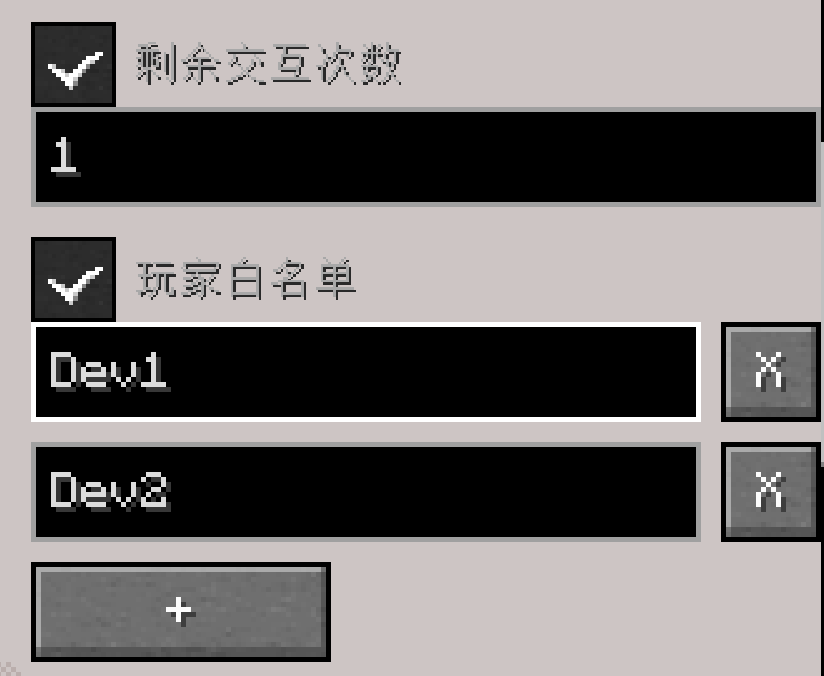
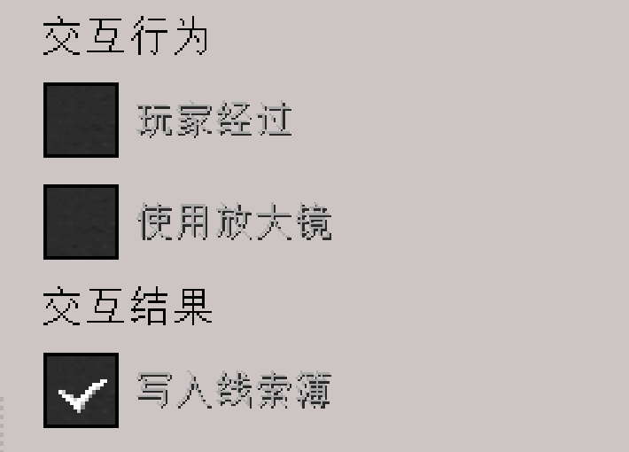
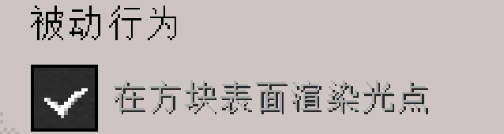
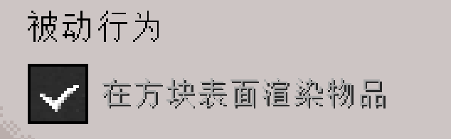

目前只搭好了主要框架, 还有很多东西没实现

# feature

已实现: 线索系统

## 线索系统

用于案发后, 查证环节前布置线索的框架. 

### 玩家手册

线索可以存在于方块或实体中, 当玩家手持放大镜对准含有线索的方块或实体, 会收到"叮"的提示音, 并看到放大镜中心出现感叹号

线索可能会有明显提示(如光点, 物品模型等), 以帮助玩家发现线索, 但也会存在没有明显提示的情况, 此时需要通过放大镜用如上的方式仔细搜寻才能发现

找到线索后, 使用放大镜右击进行交互: 
- 如果是物证, 则会得到该证物
- 如果是非物证, 则会在个人线索簿中得到文本信息
  - 线索簿通过点击物品栏左上角图标进入
  - 可以将你已发现的线索共享给其他玩家
  - 在推理中时常翻看笔记整理思路吧!

更多未知的细节等待你在游戏中探索...

### 场务手册

主持人与场务可在案发后, 查证前的这一环节中根据案件需要使用猫头鹰的法杖右击方块或实体打开gui手动布置线索.

为了便于观察已布置的线索, 手持法杖会将一定范围内的线索高亮显示, 因此玩家不应持有法杖

gui:
- 除方块外, 实体也可打开gui附加线索, 可以在尸体/玩家等实体上附加线索(放大镜同样会对实体做出反应), 例如:
  - 描述尸体情况的线索
  - 描述玩家受伤情况的线索
- gui左侧一栏是该方块/尸体中储存的线索
  - 通过顶部下拉栏选择线索类型以查看不同类型的线索(手动线索/物证等)
  - 通过顶部加号按钮在此类型下新建一个线索
  - 在列表中选中某一条目, 以在右侧面板中查看该线索详情
- 在详情面板中点及编辑按钮进入编辑模式, 功能有:
  - 编辑线索元数据 
  - 配置线索部分行为:
    - 状态: 可以用来制造玩家间的信息差 
      - 剩余交互次数: 只有前n个人能交互并发现这条线索, 
      - 玩家白名单: 只限定部分玩家可以发现该线索
    - 主动行为: 配置什么主动行为会触发交互, 以及交互的结果  
      - 使用放大镜: 常用的右击交互行为
      - 玩家经过: 经过时触发, 可以用于在玩家进入房间时描述凶案现场的线索
    - 被动行为: 配置拥有哪些被动行为    
      - 可以通过开启光点帮助玩家发现重要线索

